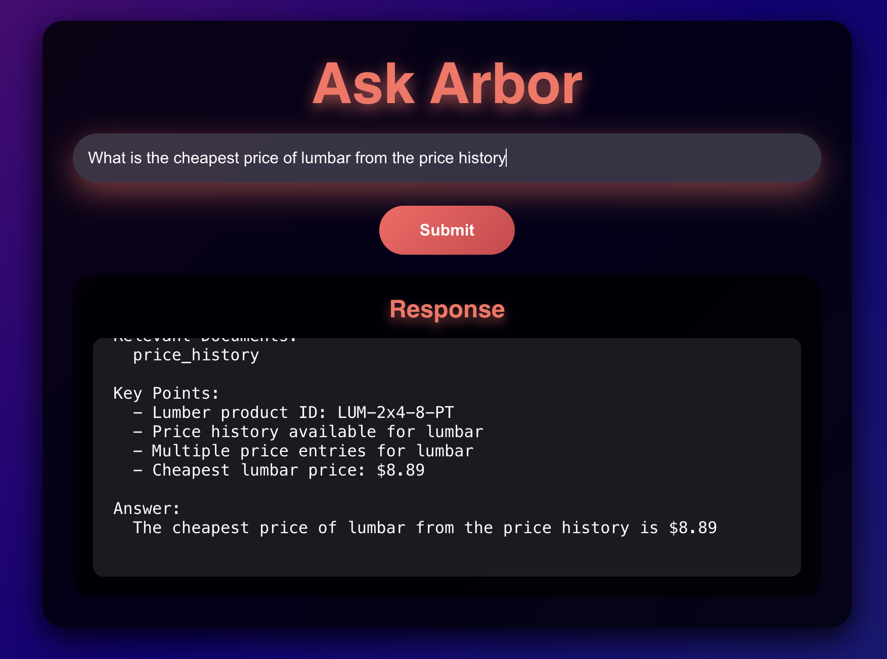
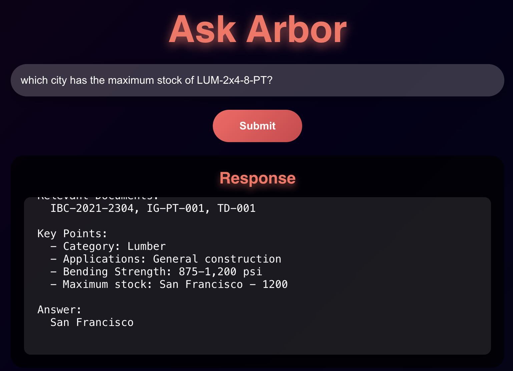

# Ask Arbor: AI-Powered Query System

**Ask Arbor** is an AI-powered query system designed for efficient retrieval and presentation of structured responses from a construction-related dataset(NoSQL). This project combines a **FastAPI** backend, a **React** frontend, and **FAISS** for vector-based semantic search. It also breaks the NoSQL data(data dense) into smaller chunks for better retrieval. Demo: https://drive.google.com/file/d/1ymz6RLxcfIXCPx69wIxcH7M_GfthR4sh/view?usp=sharing

---

## Technologies Used

### Backend

- **[FastAPI](https://fastapi.tiangolo.com/)**: A high-performance framework for building APIs.
- **Redis**: Used as a cache for storing and retrieving responses to repeated queries.
- **SentenceTransformers**: Embedding generation is done using the model `all-MiniLM-L6-v2`.
- **FAISS (Facebook AI Similarity Search)**: A vector similarity search library for querying relevant documents.

### Frontend

- **React**: A modern library for building dynamic user interfaces.
- **CSS**: Styled with custom gradients and responsive designs to ensure a sleek look.

---

## Data Processing

### Breaking Data into Smaller Chunks

To improve retrieval efficiency and accuracy, the input dataset is split into smaller chunks:

1. **product_catalog**:

   - The first four keys (`id`, `category`, `name`, and `manufacturer`) are treated as a permanent part of every chunk.
   - Remaining fields (e.g., `specifications`, `technical_details`) are split into separate entries.

2. **material_alternatives**:

   - Every chunk ensures the `primary_product_id` is included.

3. **technical_documents**, **building_codes**, **installation_guides**, and **safety_documents**:
   - These sections are kept intact and not broken into chunks.

This ensures the data is logically organized and optimized for semantic search while maintaining its context.

### FAISS Index and Metadata Creation

1. **Metadata Creation**:

   - Each data chunk is saved as a JSON entry in `arbor_metadata.json`.
   - Metadata includes sections, categories, and specific data relevant to the query.

2. **FAISS Index**:
   - Semantic embeddings are generated for each metadata chunk using the `SentenceTransformers` model.
   - These embeddings are saved in a FAISS index (`arbor_faiss.index`) for efficient similarity search.

---

## Setup Instructions

### How to run it?

**Steps**:

```bash
git clone https://github.com/saswatnayak1998/arbor.git
python fastApi_backend.py    #start the backend server
cd ask-arbor-frontend
npm install
npm start  #start the frontend server
```

## Challenges

- The dataset is in NoSQL format, with dense information like price history, there are relations too between differnet entries. For example, the material_alternatives section is linked with product_catalog so it was challenging to convert them into vectors for a RAG Application.

- To resolve this, I changed the structure of the dataset to make it into smaller chunks.
  For example,

  ```bash
  product_catalog:{
        id: "LUM-2x4-8-PT",
        category: "Lumber",
        name: "Pressure Treated Lumber 2x4x8",
        manufacturer: "TimberTech Pro",
        specifications: {
        dimensions: "1.5\" x 3.5\" x 96\"",
        grade: "Construction Grade",
        }
  }
  ```

  The above thing will be broken down into two smaller chunks

  ```bash
  product_catalog:{
    id: "LUM-2x4-8-PT",
    category: "Lumber",
    name: "Pressure Treated Lumber 2x4x8",
    manufacturer: "TimberTech Pro",
  },
  product_catalog:{
    id: "LUM-2x4-8-PT",
    category: "Lumber",
    name: "Pressure Treated Lumber 2x4x8",
    specifications: {
      dimensions: "1.5\" x 3.5\" x 96\"",
      grade: "Construction Grade",
    }
  }
  ```

  This way, the dense data is broken down into smaller chunks that can be converted into vectors and easily retrievable for RAG.

  When breaking down material_alternatives, I made sure to include the `primary_product_id` in each chunk so that it can be linked back to the product_catalog.

- Here are some examples of some complex queries which would have required us to query a NoSQL db, and answers(Which are corect):

  

  

  
